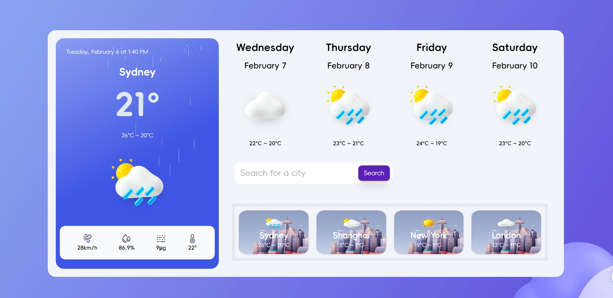
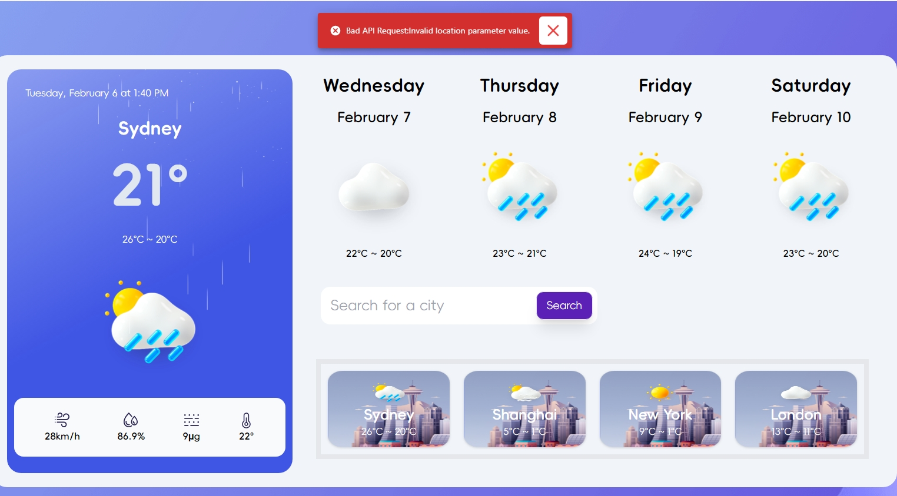
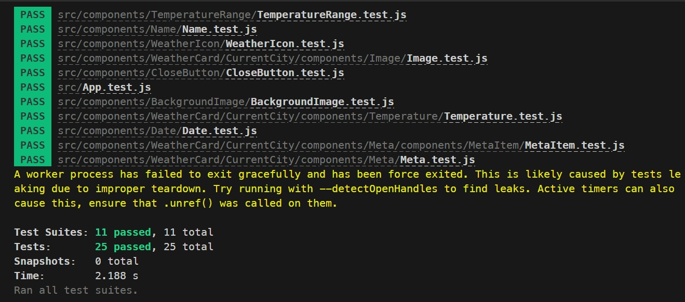

## Weather App

##### Author: Ben Chen

#### Description

An app for displaying current weather and 4 days forecasting of cities in Australia. The user can also click on a city in the search history to get the weather for the city again.

#### Important Links

[Link to Github Repo](https://github.com/bennychen2004181026/weather-app-p2)

[Link to deployed website](https://weatherwellnessretreat.netlify.app)

#### Table of Contents

- [Weather App](#Weather-App-P2)
       - [Author: Ben Chen](#author-ben-chen)
    - [Table of Contents](#table-of-contents)
    - [Local environment for testing](#local-environment-for-testing)
    - [Features](#features)
    - [Important Links](#important-links)
    - [Error Responds](#error-responds)
    - [Unit Tests](#unit-tests)
    - [Technologies Used](#technologies-used)
    - [Components Structure by Responsibilities](#components-structure-by-responsibilities)
    - [Reusable components](#reusable-components)
    - [Global Assets](#global-assets)

#### Local environment for testing

* Clone repository with `https://github.com/bennychen2004181026/weather-app-p2.git`
* Navigate into app folder with `cd front`
* Visit the [Visual Crossing Weather](https://www.visualcrossing.com/) and sign up for an account. The process usually involves providing your email address and creating a password.
* Once sign in, find the API key in the Account details.
* Create a `.env` file in the front folder with `touch .env`
* Edit the `.env` file with `REACT_APP_WEATHER_API_KEY=` and assign the key you just found in the [Visual Crossing Weather](https://www.visualcrossing.com/).
* Run `npm install` to install all the needed dependencies.
* Runs `npm start`, then the app will be run in the development mode.
* Open [http://localhost:3000](http://localhost:3000) to view it in your browser.

#### Features
* Display the current City's name with temperature, temperature range of the current date. And also displaying the four meta information below: wind speed, humidity, air quality and somatosensory. The weather image will be change along with the weather condition.
* Display the next four days weather forecasting of the current city. The weather information includes: day of the week, date, temperature range and the weather icon align with the weather condition.
* Searching the location name in the searching input box and hit `Search`. Then if the input is valid, the result of the location weather data will be displayed among the current city and forecast card.
* After the valid searching result displayed in history, it will be add up to the four cities weather indicators at the bottom.

#### Error Responds
If error happened, such as error with response from Visual Crossing Weather, the error message will be displayed in the snackbar pop up.

#### Unit Tests
Unit testing is a critical aspect of software development. It involves testing individual components or units of code to ensure they work as expected.
With the help from `@testing-library/react`, I wrote 25 unit tests for 11 fundamental components including Name, WeatherIcon, Image, etc.

#### Technologies Used

* React
* Tailwind CSS
* Visual Crossing: Weather Data & Weather API
* Node.js

##### Components Structure by Responsibilities

- App
   - WeatherCard
       - CurrentCity
           - Date
           - Name
           - Temperature
           - TemperatureRange
           - WeatherIcon
           - Meta
               - Humidity
               - Wind
               - AirQuality
               - Somatosensory
       - Forecast
           - DayOfWeek
              - Name
              - Date
              - WeatherIcon
              - TemperatureRange
       - SearchBar
           - Input
           - Button
       - OtherCities
           - CityArray
               - WeatherIcon
               - TemperatureRange

##### Reusable components

- WeatherIcon
- TemperatureRange
- Name
- Date
- BackgroundImage

#### Global Assets

- fonts
- backgroundImage
